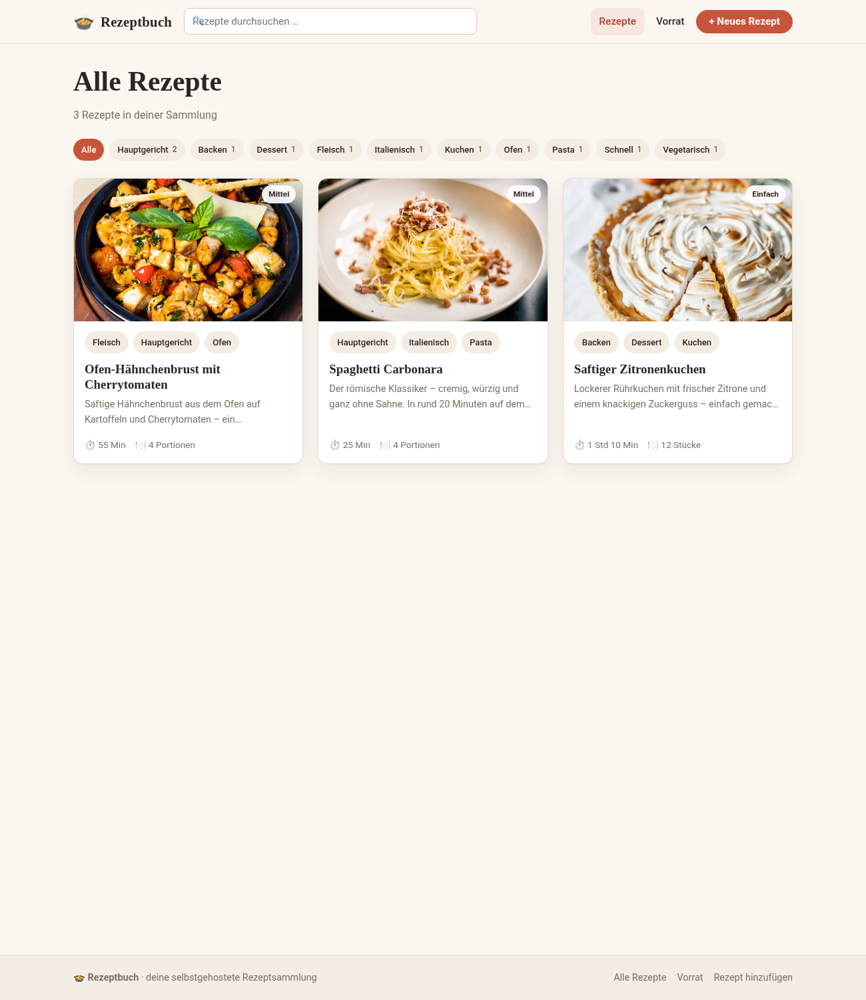
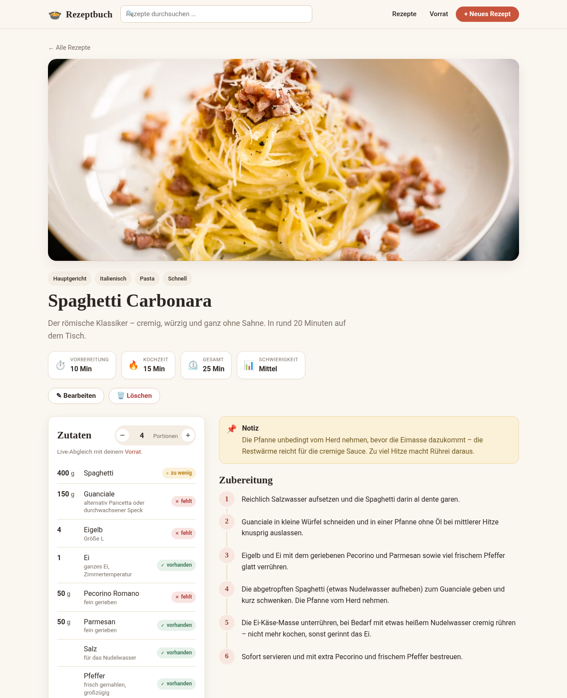
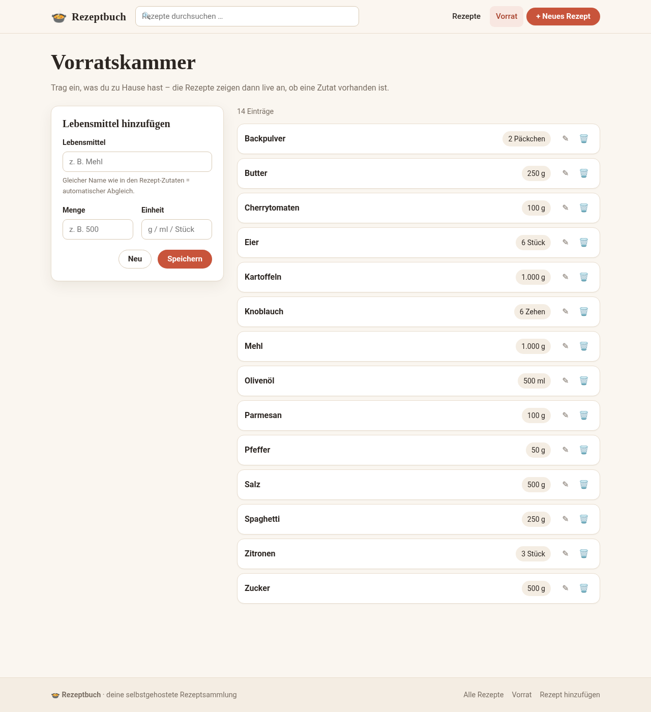

# Epulonis

**Epulonis** ist eine **selbstgehostete Rezeptplattform** zum Sammeln, Durchsuchen und Kochen eigener
Rezepte – mit Portions-Rechner und Live-Abgleich gegen den eigenen Vorrat. Läuft mit einem einzigen
`docker compose up` und speichert alles dauerhaft in einer SQLite-Datenbank.



---

## Funktionen

- **Rezepte anlegen & bearbeiten** über ein flexibles Formular: Titel, Bild, Kurzbeschreibung,
  Portionen, Vorbereitungs- und Kochzeit, Schwierigkeit, beliebig viele Zutaten, Zubereitungsschritte,
  Tags und freie Notizen (z. B. „Hähnchenbrust am Vortag in den Kühlschrank legen“).
- **Übersichtsseite** mit Karten-Layout und **Filter nach Tags**.
- **Suche mit Titel-Priorität:** Treffer im Titel ranken immer vor Treffern, die nur im Rezepttext
  (Zutaten, Schritte, Notizen) vorkommen. Eine Suche nach *Zitrone* liefert also zuerst den
  *Zitronenkuchen* und erst danach Rezepte, in denen Zitrone nur eine Zutat ist.
- **Live-Suchvorschläge** schon während des Tippens.
- **Portionsrechner:** Portionenzahl im Rezept ändern – alle Mengen rechnen sich automatisch um.
- **Vorratskammer:** eintragen, was zu Hause ist (in Gramm, Litern, Stück …). Im Rezept wird je Zutat
  **live angezeigt**, ob sie *vorhanden*, *zu wenig* oder *nicht im Vorrat* ist – inklusive
  automatischer Mengen- und Einheitenumrechnung (g/kg, ml/l) und Singular/Plural-Toleranz
  (z. B. *Zitrone* ↔ *Zitronen*).
- **Bilder aus dem Internet** per URL, mit elegantem Platzhalter, falls ein Bild mal nicht lädt.
- **Beispieldaten** (3 Rezepte + gefüllter Vorrat) werden beim ersten Start automatisch angelegt.
- Komplett **responsive** – funktioniert am Laptop wie am Handy in der Küche.

| Rezept mit Portionsrechner & Vorratsabgleich | Vorratskammer |
| --- | --- |
|  |  |

---

## Schnellstart mit Docker (empfohlen)

Voraussetzung: Docker und Docker Compose.

```bash
git clone git@github.com:flopsyan/epulonis.git
cd epulonis

# optional: Einstellungen anpassen
cp .env.example .env

docker compose up -d --build
```

Anschließend ist die Plattform unter **http://localhost:3000** erreichbar.

Die Daten liegen im Docker-Volume `rezept-daten` und bleiben bei Updates erhalten.

Stoppen / aktualisieren:

```bash
docker compose down                 # stoppen
docker compose up -d --build        # nach Änderungen neu bauen & starten
```

---

## Start ohne Docker (für Entwicklung)

Voraussetzung: Node.js ≥ 20.

```bash
npm install
npm start
# -> http://localhost:3000
```

Weitere Skripte:

```bash
npm run dev      # mit automatischem Neustart bei Dateiänderungen
npm run seed     # Beispieldaten manuell einspielen ( -- --force erzwingt es)
```

---

## Konfiguration

Alle Einstellungen erfolgen über Umgebungsvariablen (siehe `.env.example`):

| Variable     | Standard     | Bedeutung |
| ------------ | ------------ | --------- |
| `PORT`       | `3000`       | Port, unter dem die Plattform läuft |
| `SITE_NAME`  | `Epulonis`   | Name in Kopfzeile und Browser-Tab |
| `SEED_DEMO`  | `true`       | Beim allerersten Start Beispieldaten anlegen |
| `DATA_DIR`   | `./data`     | Speicherort der SQLite-Datenbank (ohne Docker) |

> Die Beispieldaten werden nur **einmalig** angelegt. Wird die Datenbank später geleert,
> kommt nichts ungewollt zurück. Für einen leeren Start einfach `SEED_DEMO=false` setzen.

---

## So funktioniert es

- **Suche & Ranking:** Der Suchbegriff wird gegen Titel, Beschreibung, Zutaten, Schritte, Notizen und
  Tags geprüft. Ein Titeltreffer wiegt deutlich schwerer als alle Inhaltstreffer zusammen – dadurch
  steht der „echte“ Treffer immer oben. Umlaute und Groß-/Kleinschreibung werden ignoriert.
- **Portionsrechner:** Jede Zutat speichert ihre Basismenge. Beim Ändern der Portionen wird mit dem
  Faktor `neue Portionen / Basisportionen` neu gerechnet (deutsche Zahlenformatierung mit Komma).
- **Vorratsabgleich:** Zutaten- und Vorratsnamen werden normalisiert (Kleinschreibung, einfache
  Pluralvereinheitlichung) und Mengen in eine gemeinsame Basiseinheit umgerechnet
  (Masse → g, Volumen → ml, Anzahl → Stück). Passen die Einheiten nicht zusammen (z. B. „EL“ vs. „ml“),
  wird die Zutat als vorhanden, aber ohne Mengenvergleich angezeigt. Tipp: Für den Abgleich denselben
  Namen wie in den Rezept-Zutaten verwenden.

---

## Daten & Backup

Alle Inhalte liegen in einer einzigen SQLite-Datei.

- **Mit Docker:** im Volume `epulonis_rezept-daten` (Pfad im Container: `/app/data/rezepte.sqlite`).
  Backup z. B. mit `docker run --rm -v epulonis_rezept-daten:/data -v "$PWD":/backup busybox tar czf /backup/rezepte-backup.tgz -C /data .`
- **Ohne Docker:** im Ordner `data/` (per `DATA_DIR` änderbar). Einfach den Ordner sichern.

---

## Projektstruktur

```
epulonis/
├── src/
│   ├── server.js          # Express-App, Einstieg
│   ├── db.js              # SQLite-Verbindung & Schema
│   ├── seed.js            # Beispieldaten
│   ├── lib/               # Slug-, Einheiten- & Formatierungs-Helfer
│   ├── models/            # Datenzugriff (Rezepte, Tags, Vorrat)
│   └── routes/            # Seiten- und API-Routen
├── views/                 # EJS-Templates
├── public/                # CSS & clientseitiges JavaScript
├── Dockerfile
├── docker-compose.yml
└── .env.example
```

## Technik

Node.js · Express · EJS (serverseitig gerendert) · better-sqlite3 · reines Vanilla-JS im Browser
(kein Build-Schritt nötig). Bewusst schlank und abhängigkeitsarm, damit es leicht selbst zu hosten
und zu warten ist.

## Lizenz

[Apache License 2.0](LICENSE)
