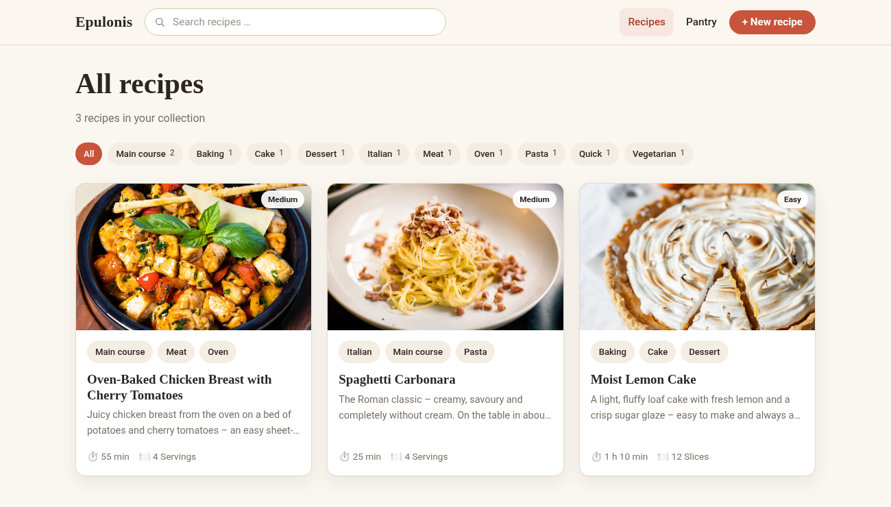
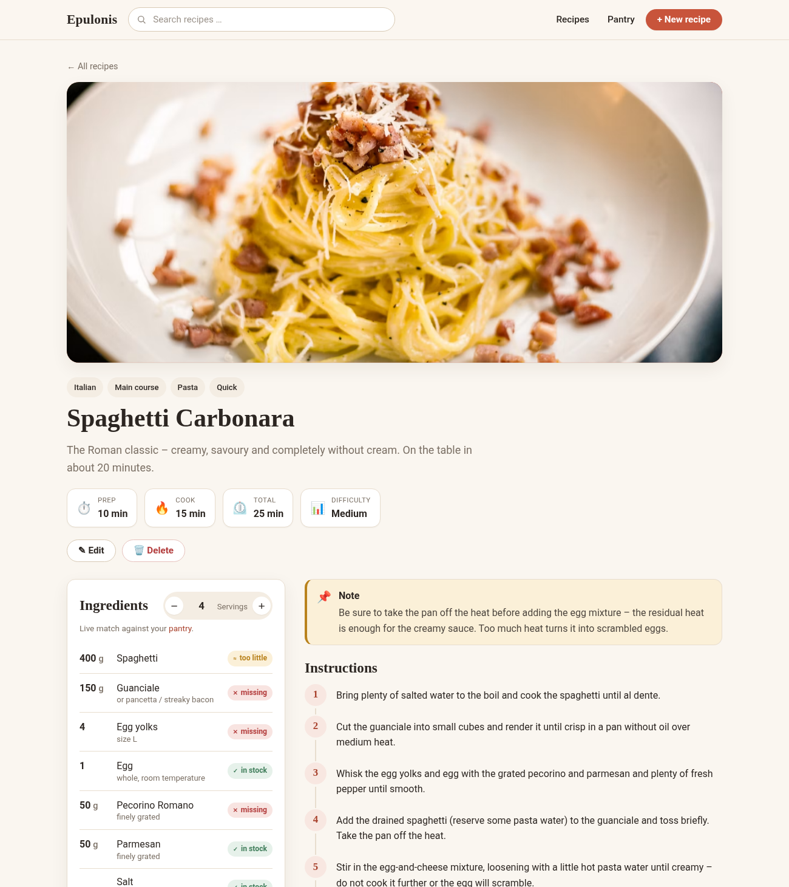
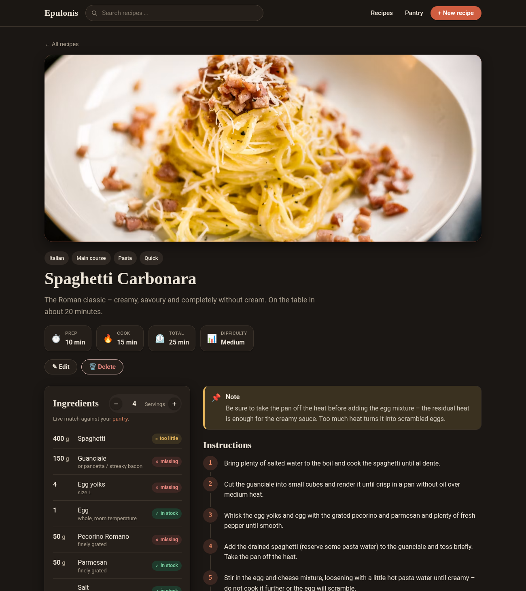

# Epulonis

**Epulonis** is a **self-hosted recipe platform** for collecting, searching and cooking your own
recipes – with a servings calculator and a live match against your own pantry. It runs with a single
`docker compose up` and stores everything permanently in a SQLite database.



---

## Features

- **Create & edit recipes** through a flexible form: title, image, short description, servings,
  prep and cook time, difficulty, any number of ingredients and steps, tags and free-form notes
  (e.g. “put the chicken breast in the fridge the day before”).
- **Overview page** with a card layout and **tag filtering**.
- **Search with title priority:** title matches always rank above matches that only appear in the
  recipe text (ingredients, steps, notes). A search for *lemon* returns the *Lemon Cake* first, and
  only then recipes that merely use lemon as an ingredient.
- **Live search suggestions** as you type.
- **Servings calculator:** change the number of servings and all amounts recalculate automatically.
- **Pantry:** record what you have at home (in grams, litres, pieces …). Every recipe then shows
  **live** whether an ingredient is *in stock*, *too little* or *missing* – including automatic
  amount/unit conversion (g/kg, ml/l) and singular/plural tolerance (e.g. *lemon* ↔ *lemons*).
- **Light & dark mode** with a switch in the footer (defaults to **System**).
- **English & German UI** with a language switch in the footer (defaults to **English**).
- **Images from the web** via URL, with an elegant placeholder if an image fails to load.
- **Demo data** (3 recipes + a stocked pantry) is created automatically on first start.
- Fully **responsive** – works on a laptop and on your phone in the kitchen.

| Recipe with servings calculator & pantry match | Dark mode |
| --- | --- |
|  |  |

---

## Quick start with Docker (recommended)

Requirements: Docker and Docker Compose.

```bash
git clone https://github.com/flopsyan/epulonis.git
cd epulonis

# optional: adjust settings
cp .env.example .env

docker compose up -d --build
```

The platform is then available at **http://localhost:3000**.

The data lives in the Docker volume `epulonis_recipe-data` and survives updates.

Stop / update:

```bash
docker compose down                 # stop
docker compose up -d --build        # rebuild & start after changes
```

---

## Run without Docker (for development)

Requirements: Node.js ≥ 20.

```bash
npm install
npm start
# -> http://localhost:3000
```

More scripts:

```bash
npm run dev      # restarts automatically on file changes
npm run seed     # seed demo data manually ( -- --force to override )
```

---

## Configuration

Everything is configured via environment variables (see `.env.example`):

| Variable     | Default     | Meaning |
| ------------ | ----------- | ------- |
| `PORT`       | `3000`      | Port the platform runs on |
| `SITE_NAME`  | `Epulonis`  | Name shown in the header and browser tab |
| `SEED_DEMO`  | `true`      | Seed demo data on the very first start |
| `DATA_DIR`   | `./data`    | Storage location of the SQLite database (without Docker) |

> Demo data is only created **once**. If you later empty the database, nothing comes back
> unexpectedly. For an empty start, set `SEED_DEMO=false`.

---

## How it works

- **Search & ranking:** the query is matched against the title, description, ingredients, steps,
  notes and tags. A title match weighs much more than all content matches combined, so the “real”
  match always stays on top. Case is ignored.
- **Servings calculator:** every ingredient stores its base amount. When the servings change, amounts
  are recomputed with the factor `new servings / base servings`.
- **Pantry match:** ingredient and pantry names are normalized (lowercase, simple plural unification)
  and amounts are converted into a common base unit (mass → g, volume → ml, count → pcs). If the units
  don’t match (e.g. “tbsp” vs. “ml”), the ingredient is shown as in stock but without an amount
  comparison. Tip: use the same name as in the recipe ingredients for the match to work.

---

## Data & backup

All content lives in a single SQLite file.

- **With Docker:** in the volume `epulonis_recipe-data` (path inside the container:
  `/app/data/recipes.sqlite`).
  Back up e.g. with `docker run --rm -v epulonis_recipe-data:/data -v "$PWD":/backup busybox tar czf /backup/recipes-backup.tgz -C /data .`
- **Without Docker:** in the `data/` folder (configurable via `DATA_DIR`). Just back up that folder.

---

## Project structure

```
epulonis/
├── src/
│   ├── server.js          # Express app, entry point
│   ├── db.js              # SQLite connection & schema
│   ├── seed.js            # demo data
│   ├── lib/               # slug, units & formatting helpers
│   ├── models/            # data access (recipes, tags, pantry)
│   └── routes/            # page and API routes
├── views/                 # EJS templates
├── public/                # CSS & client-side JavaScript
├── Dockerfile
├── docker-compose.yml
└── .env.example
```

## Tech

Node.js · Express · EJS (server-rendered) · better-sqlite3 · plain vanilla JS in the browser
(no build step). Deliberately lean and low on dependencies, so it’s easy to self-host and maintain.

## License

[Apache License 2.0](LICENSE)
